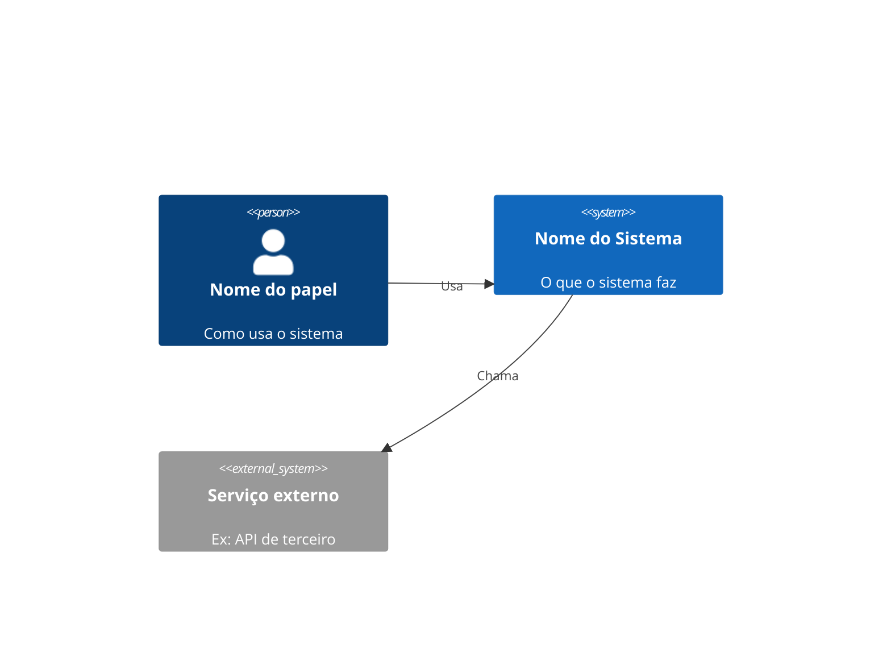

<objective>
Generate `projects/<slug>/architecture/architecture.md` for the project named in `$ARGUMENTS`, following the arc42 template (12 sections) with Mermaid C4 diagrams, sourced primarily from the project's PRD(s) in `projects/<slug>/prds/`. Ask the user only for what the PRD doesn't cover. Propose ADR stubs (from `templates/ADR-template.md`) for decisions the PRD leaves open.
</objective>

<preconditions>
- `$ARGUMENTS` must name an existing `projects/<slug>/` directory. If it doesn't exist, stop and tell the user to create the project first — this skill does not create projects.
- If `projects/<slug>/architecture/architecture.md` already exists, ask the user: overwrite, merge (keep existing section content where the PRD has nothing new to add), or cancel.
</preconditions>

<steps>

1. **Locate and read the PRD.**
   - List `projects/<slug>/prds/`. If empty, skip to step 3 with no PRD text — every arc42 section will need a question.
   - If more than one file, use the one with the most recent mtime (`ls -t`) and tell the user which file was picked and why.
   - `.md` files: read directly.
   - `.docx` files: run `python3 .claude/skills/architecture-doc/scripts/extract_docx_text.py <path>` and use its stdout as the PRD text.

2. **Map PRD content to the 12 arc42 sections** (see `<arc42-sections>`). For each section, decide: covered by the PRD, or a gap.

3. **Fill gaps interactively.** One focused question per gap, one at a time. Use `AskUserQuestion` when the answer has enumerable options; ask directly otherwise. Never ask about something the PRD already answers.

4. **Generate Mermaid C4 diagrams**: at minimum a Context diagram (arc42 §3) and a Container diagram (arc42 §5), built from the stack/entities identified in the PRD or gathered in step 3. Use `C4Context` / `C4Container` syntax — see `<mermaid-c4-example>`.

5. **Detect open decisions and propose ADR stubs.** Scan the PRD text for markers of an unresolved technical decision: phrases like "decisão pendente", "a definir", "TBD", or a sentence ending in "?" near words like "arquitetura", "stack", "banco", "perfil". For each match found, show the surrounding sentence to the user and ask for confirmation before creating anything. On confirmation:
   - Find the next ADR number in `projects/<slug>/architecture/adr/` — 4-digit zero-padded, starting at `0001`.
   - Copy `templates/ADR-template.md` to `projects/<slug>/architecture/adr/NNNN-<titulo-curto>.md`, fill in the title and set status to `proposto`, and put the PRD's own wording about the open question into the "Contexto" section.

6. **Write `projects/<slug>/architecture/architecture.md`** using `<architecture-template>`, filled with the content from steps 2-4.

7. **Summarize**: list what was written, and list any ADR stubs created that still need a decision.

</steps>

<arc42-sections>
1. Introdução e Metas — objetivo do sistema, requisitos essenciais, stakeholders.
2. Restrições de Arquitetura — restrições técnicas, organizacionais, regulatórias.
3. Escopo e Contexto do Sistema — fronteira do sistema, quem/o que interage com ele (vira o diagrama de Contexto C4).
4. Estratégia de Solução — decisões tecnológicas de alto nível e por quê.
5. Visão de Building Blocks — decomposição em módulos/serviços (vira o diagrama de Container C4).
6. Visão de Runtime — fluxos principais (ex: uma jornada de usuário ponta a ponta).
7. Visão de Deployment — onde e como o sistema roda em produção.
8. Conceitos Transversais — segurança, autenticação, tratamento de erros, i18n, etc.
9. Decisões de Arquitetura — lista as ADRs (com link pra `architecture/adr/`).
10. Requisitos de Qualidade — atributos de qualidade priorizados, com métricas quando existirem.
11. Riscos e Dívida Técnica — riscos conhecidos e mitigação.
12. Glossário — termos do domínio.
</arc42-sections>

<mermaid-c4-example>

</mermaid-c4-example>

<architecture-template>
```markdown
# Arquitetura — <Nome do Projeto>

- **Status**: rascunho
- **Data**: <data de hoje>
- **PRD de origem**: `projects/<slug>/prds/<arquivo>`

## 1. Introdução e Metas

## 2. Restrições de Arquitetura

## 3. Escopo e Contexto do Sistema

```mermaid
C4Context
```

## 4. Estratégia de Solução

## 5. Visão de Building Blocks

```mermaid
C4Container
```

## 6. Visão de Runtime

## 7. Visão de Deployment

## 8. Conceitos Transversais

## 9. Decisões de Arquitetura

Ver `architecture/adr/`.

| ADR | Título | Status |
|---|---|---|

## 10. Requisitos de Qualidade

## 11. Riscos e Dívida Técnica

## 12. Glossário
```
</architecture-template>
