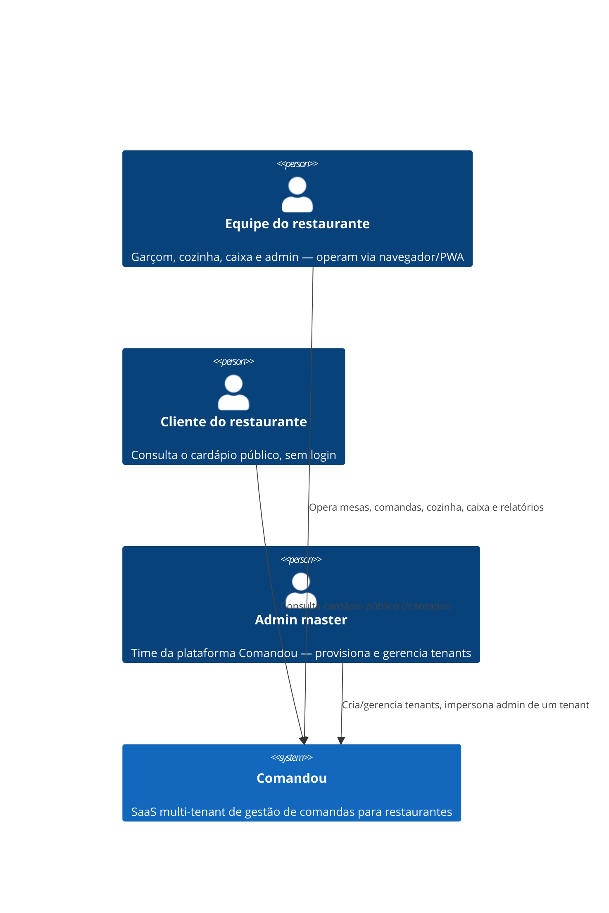
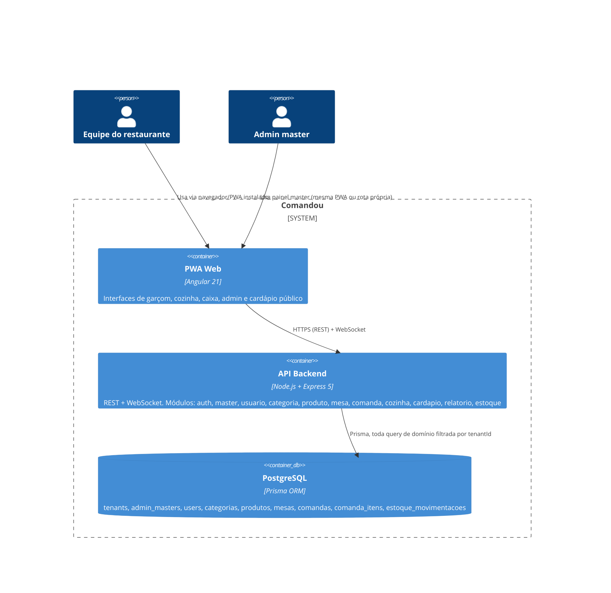

# Arquitetura — Comandou

- **Status**: rascunho
- **Data**: 2026-07-29
- **PRD de origem**: nenhum — gerado a partir da revisão direta do código em `comandou-api` e `comandou-web` (sem PRD em `projects/comandou/prds/` no momento)

## 1. Introdução e Metas

Comandou é um SaaS multi-tenant de gestão de comandas para restaurantes, entregue como PWA. Cada restaurante (tenant) acessa por seu próprio subdomínio (`restaurante.comandou.app.br`) e opera com 4 perfis de usuário, cada um com sua própria interface: **garçom** (mesas e pedidos, mobile), **cozinha** (fila de itens em tempo real, tablet/TV), **caixa** (fechamento e divisão de conta, desktop/tablet) e **admin** (CRUD completo + relatórios, desktop). Existe também um cardápio público sem autenticação e um painel de **admin master**, separado dos tenants, para provisionar e gerenciar restaurantes na plataforma.

Estágio atual: **MVP em desenvolvimento**, sem clientes reais em produção. A meta é validar ponta a ponta o fluxo operacional dos 4 perfis (abrir comanda → pedir → preparar → entregar → fechar/dividir conta) com sincronização em tempo real entre eles. Não há PRD formal nem métricas de negócio (retenção, NPS, MRR) definidas até o momento.

## 2. Restrições de Arquitetura

- **Organizacional**: sem PRD formal; repositório mantido por um único desenvolvedor/owner, dividido em dois repositórios (`comandou-api`, `comandou-web`) com CI independente em cada um.
- **Técnica**: multi-tenancy já é a fundação do sistema desde o início (`Tenant` como entidade raiz, todas as tabelas de domínio com `tenantId`, middleware `tenantResolver` em toda rota não-master) — diferente de um MVP single-tenant, essa decisão já foi tomada e implementada, não está em aberto.
- **Regulatória**: sistemas de venda em restaurantes no Brasil normalmente exigem emissão de nota fiscal (NFC-e); isso não está implementado nem decidido — ver [ADR-0001](adr/0001-modelo-de-cobranca-e-compliance-fiscal.md). Dados de cliente (`Comanda.nomeCliente`) são coletados sem tratamento explícito de privacidade/LGPD no código.
- **Segurança**: `JWT_SECRET`, `MASTER_JWT_SECRET` e `REFRESH_TOKEN_SECRET` têm fallback hardcoded no código-fonte para desenvolvimento — risco se essas variáveis não forem configuradas em produção (ver seção 11).

## 3. Escopo e Contexto do Sistema

Não há integrações com serviços de terceiros no código atual (sem gateway de pagamento, sem emissor fiscal, sem provedor de e-mail) — o sistema hoje é autocontido.

## 4. Estratégia de Solução

| Camada | Tecnologia | Justificativa |
|---|---|---|
| Frontend | Angular 21 (Signals, Signal Forms, `resource()`, standalone components) | Reatividade moderna sem NgRx; `resource()` cobre a maioria dos casos de dado assíncrono |
| Design System | b-system (tokens Terracotta/Cream, Nunito, Lucide) | Consistência visual sem dependência de libs de UI externas (Material, PrimeNG etc. são proibidos por convenção) |
| Backend | Node.js 20 + Express 5 + TypeScript (ESM puro) | Leve, familiar, mesma linguagem do frontend |
| Banco | PostgreSQL + Prisma ORM 7 (`@prisma/adapter-pg`) | Multi-tenancy via `tenantId` em toda tabela de domínio, migrations versionadas |
| Realtime | Socket.io | Rooms por tenant para propagar eventos de comanda/item sem polling |
| Autenticação | JWT (access 15min + refresh 7d) + bcrypt | Access token curto reduz janela de exposição; refresh persistido e revogável no banco |
| Validação | Zod | Schemas e tipos inferidos compartilhando a mesma definição |
| Testes (backend) | Vitest + Supertest, banco real de teste (`DATABASE_URL_TEST`) | Nunca mocka o banco — testes de integração reais |
| Deploy | Vercel (frontend) + Railway (backend) | CI/CD automático a cada push em `main` |

## 5. Visão de Building Blocks

Cada módulo do backend segue um padrão fixo de 4 arquivos (`<modulo>.routes.ts`, `.controller.ts`, `.service.ts`, `.schemas.ts`). As rotas de `master` são registradas em `app.ts` **antes** do middleware `tenantResolver` — o painel master não pertence a nenhum tenant e usa seu próprio segredo JWT (`MASTER_JWT_SECRET`) e guard (`masterGuard`). As demais rotas passam por `tenantResolver` (resolve o tenant por header `X-Tenant-Slug` em dev ou subdomínio em produção) e, quando autenticadas, por `authenticate` + `authorize(...perfis)`.

Tabelas do banco: `tenants` é o tenant raiz. Com `tenant_id` direto: `users`, `categorias`, `produtos`, `mesas`, `comandas`. Isolamento transitivo via FK: `comanda_itens` (via `comanda_id`), `estoque_movimentacoes` (via `produto_id`). `admin_masters` é global à plataforma, sem `tenant_id`.

## 6. Visão de Runtime

Fluxo principal — ciclo de vida de um pedido:

1. **Abertura**: garçom abre uma comanda numa mesa (`abrirComanda`), vinculada ao tenant.
2. **Pedido**: garçom adiciona item à comanda (`adicionarItem`) — valida disponibilidade e estoque do produto, decrementa o estoque e emite `item:novo` na room do tenant via WebSocket.
3. **Preparo**: cozinha vê o item na fila em tempo real (`listarFila`) e avança o status `pendente → em_preparo → pronto` (`avancarStatusItem`) — cada perfil só pode definir os status permitidos para ele (`cozinha`: em_preparo/pronto; `garcom`: entregue; `admin`: todos).
4. **Entrega**: garçom marca o item como `entregue`.
5. **Fechamento**: caixa fecha a comanda (`fecharComanda`) — bloqueia se houver item `pendente` ou `em_preparo` (a menos que `ignorarPendentes` seja explicitamente passado), calcula o total e emite `comanda:fechada`. Pode dividir a conta em N partes (`dividirConta`) antes de fechar.

Fluxo secundário — provisionamento de tenant: admin master faz login (`masterLogin`, JWT próprio), cria um tenant (`criarTenant`, transação que cria `Tenant` + primeiro `User` com perfil `admin`) e pode entrar como esse admin sem senha (`impersonateTenant`, gera um access token normal do tenant).

Item de comanda cancelado a qualquer momento antes de `pronto`/`entregue` reverte o estoque reservado (`cancelamento`).

## 7. Visão de Deployment

Frontend (Angular, build `ng build`) na Vercel, com rewrite de SPA (`vercel.json`) para todas as rotas caírem em `index.html`. Backend na Railway, deploy automático a cada push em `main` (rollback manual pelo painel da Railway). O provedor e a política de backup do PostgreSQL não estão documentados no repositório — assume-se Railway, mas isso não está confirmado em nenhum arquivo de configuração. CI (GitHub Actions) roda lint, typecheck, testes (com banco Postgres efêmero em serviço do próprio workflow) e build em cada push/PR para `main`, em ambos os repositórios, antes do deploy.

## 8. Conceitos Transversais

- **Multi-tenancy**: tenant resolvido pelo middleware `tenantResolver` — header `X-Tenant-Slug` em qualquer ambiente, ou subdomínio (`restaurante.comandou.app.br`) quando não há header. Toda query de domínio filtra por `tenantId`; o payload do JWT carrega `tenantId` e é comparado ao tenant resolvido na request — mismatch retorna 403. Isolamento é feito em nível de aplicação (filtro explícito por `tenantId` em toda query Prisma), não via Row Level Security do Postgres.
- **Autenticação**: JWT access token (15 min) + refresh token (7 dias), refresh persistido em `users.refresh_token` e revogável (logout limpa o campo). Frontend nunca guarda o JWT em `localStorage`/`sessionStorage` — fica só em memória via signal; refresh token trafega em cookie `httpOnly`.
- **Autorização (RBAC)**: perfis `admin`, `garcom`, `cozinha`, `caixa`, aplicados via `authorize(...perfis)` nas rotas. O painel master tem seu próprio mecanismo (`masterGuard` + `MASTER_JWT_SECRET`), desacoplado do RBAC de tenant.
- **Realtime**: Socket.io autentica no handshake via JWT (mesmo `JWT_SECRET` da API); cada socket entra automaticamente na room `tenant:${tenantId}`. Eventos: `item:novo`, `item:atualizado`, `item:cancelado`, `comanda:fechada`.
- **Máquina de estados de item**: `pendente → em_preparo → pronto → entregue`, com `cancelado` possível antes de `pronto`/`entregue`; transições restritas por perfil.
- **Estoque**: decrementado ao adicionar item, revertido ao editar/cancelar; produto marcado `disponivel: false` automaticamente quando o estoque chega a 0. Toda movimentação gera um registro em `estoque_movimentacoes` (auditável).
- **Segurança de request**: `helmet`, CORS com allowlist (`CORS_ORIGIN` + regex para `*.comandou.app.br` e `*.vercel.app`), `cookie-parser` para o cookie httpOnly do refresh token.
- **i18n**: não aplicável — produto 100% em português.

## 9. Decisões de Arquitetura

Ver `architecture/adr/`.

| ADR | Título | Status |
|---|---|---|
| [0001](adr/0001-modelo-de-cobranca-e-compliance-fiscal.md) | Modelo de cobrança e compliance fiscal (NFC-e) ainda não definidos | proposto |

## 10. Requisitos de Qualidade

Sem PRD formal, não há metas de negócio (retenção, NPS, MRR) definidas ainda. Os requisitos abaixo foram derivados do próprio comportamento implementado no código:

| Requisito | Meta |
|---|---|
| Sincronização entre perfis | Mudança de status de item deve refletir em cozinha/garçom em tempo real via WebSocket, sem polling |
| Isolamento multi-tenant | Nenhum dado de um tenant acessível por outro, mesmo com JWT válido de outro tenant (`tenantId` mismatch → 403) |
| Consistência de estoque | Toda entrada/saída/cancelamento de estoque gera registro auditável em `estoque_movimentacoes` |
| Integridade de fechamento | Comanda não pode ser fechada com itens `pendente`/`em_preparo`, salvo confirmação explícita (`ignorarPendentes`) |

## 11. Riscos e Dívida Técnica

| Risco | Impacto | Mitigação |
|---|---|---|
| `JWT_SECRET`, `MASTER_JWT_SECRET` e `REFRESH_TOKEN_SECRET` têm fallback hardcoded no código | Alto — comprometimento total de auth se a env var não for configurada em produção | Falhar o boot do servidor se os secrets de produção não estiverem definidos, nunca depender do fallback |
| Sem rate limiting na API (nenhuma dependência de rate limit no `package.json`) | Médio — força bruta em `/auth/login` e `/master/auth/login`, abuso do endpoint público `/cardapio` | Adicionar `express-rate-limit` ou equivalente, priorizando as rotas de login |
| Modelo de cobrança e compliance fiscal (NFC-e) não definidos | Alto — bloqueia qualquer lançamento comercial e traz risco jurídico/fiscal | Ver [ADR-0001](adr/0001-modelo-de-cobranca-e-compliance-fiscal.md) |
| Refresh token armazenado em texto plano em `users.refresh_token` | Médio — vazamento do banco expõe tokens de sessão válidos por 7 dias | Persistir um hash do refresh token em vez do valor puro |
| Deploy do banco de dados não documentado no repositório (assumido Railway) | Baixo — falta de clareza operacional sobre backup/restore | Documentar provedor, política de backup e plano de recuperação do Postgres de produção |

## 12. Glossário

| Termo | Definição |
|---|---|
| Tenant | Um restaurante cliente da plataforma; unidade de isolamento multi-tenant |
| Comanda | Conta aberta associada a uma mesa, contém os itens pedidos até o fechamento |
| Mesa | Mesa física do restaurante, unidade à qual uma comanda é vinculada |
| Perfil | Papel do usuário dentro de um tenant: `admin`, `garcom`, `cozinha`, `caixa` |
| Admin master | Usuário da plataforma (fora de qualquer tenant) que provisiona e gerencia restaurantes |
| Impersonar | Admin master gerar um token de acesso como o admin de um tenant, sem saber a senha |
| PWA | Progressive Web App — instalável no celular/tablet |
| RBAC | Role-Based Access Control — controle de acesso por perfil |
| JWT | JSON Web Token — token de autenticação stateless |
| Refresh token | Token de longa duração (7 dias) usado para renovar o access token sem novo login |
| ESM | ECMAScript Modules — formato de módulo usado no backend (`"type": "module"`), imports internos exigem extensão `.js` |
| NFC-e | Nota Fiscal de Consumidor Eletrônica — documento fiscal brasileiro para venda ao consumidor, não implementado no sistema |
