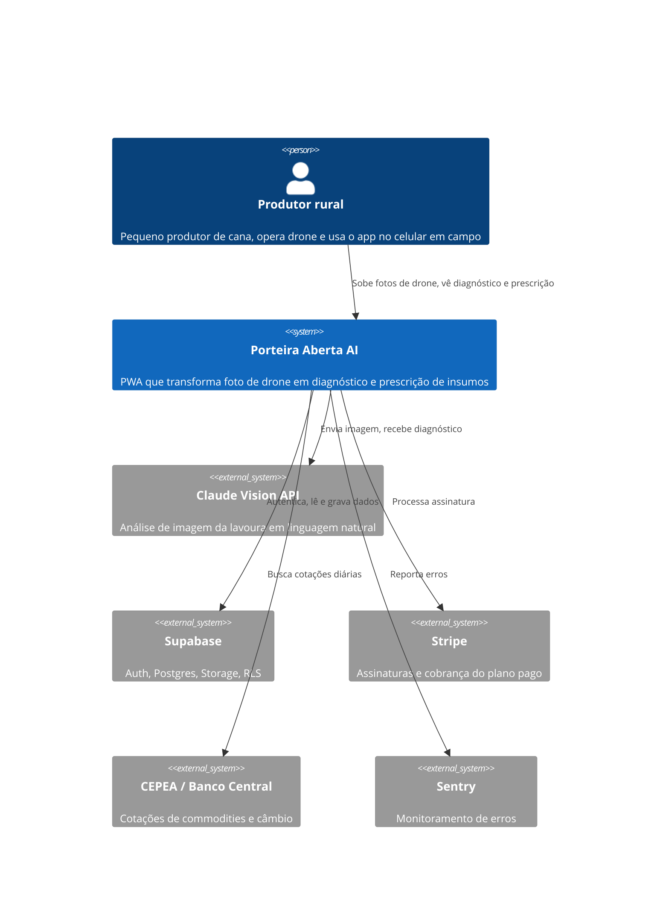
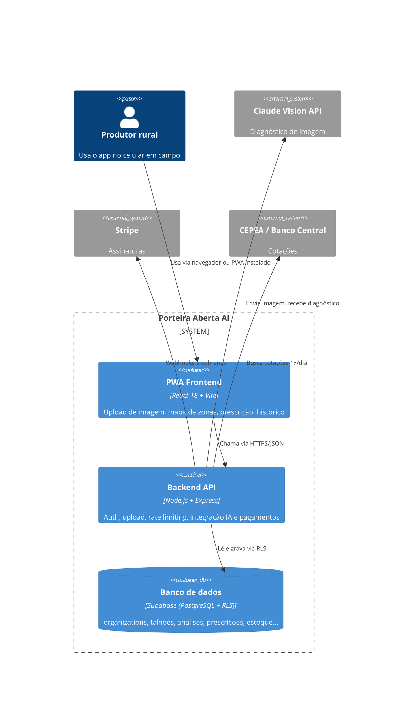

# Arquitetura — Porteira Aberta AI

- **Status**: rascunho
- **Data**: 2026-07-26
- **PRD de origem**: `projects/porteira-aberta-ai/prds/PRD_PorteiraAbertaAI_v1.docx`

## 1. Introdução e Metas

PWA que permite ao pequeno produtor de cana-de-açúcar subir imagens de drone e receber, em segundos, diagnóstico da lavoura em linguagem simples e prescrição prática de aplicação de insumos. Evolui de ferramenta de análise de imagem para ERP agrícola completo (safra, estoque, financeiro, agrocomércio), com perfis multi-tenant desde a fundação técnica.

Responsável de produto: Mario (PO). Áreas envolvidas: Frontend, Backend, IA/Prompt Engineering, Design/UX, Dados/Banco, Negócio/GTM, Segurança.

Metas do MVP (90 dias pós-lançamento): 200 contas ativas, 60% de ativação em 7 dias, retenção D30 de 40%, NPS ≥ 40, conversão freemium→pago de 15%, MRR de R$ 2.000 ao fim do mês 3.

## 2. Restrições de Arquitetura

- **Regulatória**: operação de drones é regulada pela ANAC (RBAC-E nº 94), mas não se aplica diretamente — a plataforma só recebe imagens já capturadas pelo usuário. Prescrição de defensivos com valor legal exige assinatura de agrônomo credenciado no CREA; o produto deixa isso explícito e nunca se apresenta como laudo técnico.
- **Organizacional**: time de 1-2 desenvolvedores; MVP em 6 sprints de 2 semanas (12 semanas) até o lançamento beta.
- **Técnica**: arquitetura multi-tenant (banco, auth, permissões) construída desde o Sprint 1, mesmo com apenas o perfil Produtor habilitado no MVP — ver [ADR-0001](adr/0001-arquitetura-multi-perfil-no-mvp.md) para a decisão em aberto sobre esse trade-off.
- **Segurança**: chaves de API (Claude, Supabase `service_role`, Stripe) nunca expostas no frontend — toda chamada externa passa pelo backend (RN-006).

## 3. Escopo e Contexto do Sistema

## 4. Estratégia de Solução

| Camada | Tecnologia | Justificativa |
|---|---|---|
| Frontend | React 18 + Vite | Rápido de aprender, grande ecossistema, build otimizado para PWA |
| PWA | vite-plugin-pwa | Service Worker e manifest automáticos, instalação no celular |
| Backend | Node.js + Express | Leve, familiar, amplo suporte a middleware de segurança |
| IA / Visão | Claude Vision API | Análise de imagem nativa, resposta em português |
| Banco | Supabase (PostgreSQL) | Auth, Storage, RLS, Realtime, sem DevOps próprio |
| Mapa | Leaflet.js + GeoTIFF.js | Renderização de mapas georreferenciados leve no mobile |
| Deploy | Vercel (frontend) + Railway (backend) | CI/CD automático, free tier generoso |
| Pagamentos | Stripe | Assinaturas mensais, webhooks, portal do cliente |

## 5. Visão de Building Blocks

Principais tabelas do banco (todas com `org_id` para isolamento multi-tenant via RLS): `organizations`, `org_members`, `profiles`, `talhoes`, `analises`, `prescricoes`, `estoque`, `mov_estoque`, `financeiro`, `safra`, `ordens_servico`, `commodities_cache`, `planos`.

## 6. Visão de Runtime

Fluxo principal — primeira análise (onboarding):

1. **Cadastro**: usuário cria conta com e-mail/senha, tutorial de 3 passos, sem dados de cartão.
2. **Upload**: seleciona foto JPEG/PNG do drone, preenche talhão (opcional), toca em "Analisar com IA".
3. **Resultado**: mapa colorido (verde/amarelo/vermelho) com diagnóstico em texto simples.
4. **Prescrição**: o quê aplicar, onde e quanto, estimativa de custo, aviso para confirmar com agrônomo.
5. **Avaliação**: botão "isso está correto?" alimenta a métrica de precisão percebida.

## 7. Visão de Deployment

Frontend na Vercel, backend na Railway, banco gerenciado pelo Supabase (PostgreSQL). Monitoramento de erros via Sentry, performance via Vercel Analytics. CI/CD automático em ambas as plataformas de deploy.

## 8. Conceitos Transversais

- **Autenticação**: Supabase Auth, token JWT válido por 7 dias com refresh automático.
- **Autorização (RBAC)**: papéis `owner`, `admin`, `agrônomo`, `viewer`, `super_admin`, aplicados em duas camadas — políticas RLS no Supabase e middleware no backend. Regra de ouro: nenhum dado de uma organização é acessível a outra, mesmo com usuário compartilhado.
- **Segurança de upload**: validação de MIME type real via biblioteca `file-type` (nunca confia na extensão do arquivo); limite de 50 MB; formatos aceitos JPEG/PNG.
- **Rate limiting**: 10 requisições/min por usuário autenticado (`express-rate-limit`); plano gratuito limitado a 3 análises/mês.
- **Prompt injection**: input do usuário (nome do talhão, variedade) nunca é concatenado diretamente no system prompt da Claude API — sempre passado como dado estruturado.
- **i18n**: não aplicável no MVP — produto 100% em português.

## 9. Decisões de Arquitetura

Ver `architecture/adr/`.

| ADR | Título | Status |
|---|---|---|
| [0001](adr/0001-arquitetura-multi-perfil-no-mvp.md) | Arquitetura multi-perfil desde o Sprint 1 do MVP | proposto |

## 10. Requisitos de Qualidade

| Requisito | Meta |
|---|---|
| Tempo médio de análise | ≤ 30 segundos (upload → diagnóstico) |
| Precisão percebida | > 70% dos usuários concordam com o diagnóstico |
| Retenção D30 | 40% dos usuários retornam em 30 dias |
| NPS | ≥ 40 |
| Tamanho máximo de upload | 50 MB por arquivo |

## 11. Riscos e Dívida Técnica

| Risco | Impacto | Mitigação |
|---|---|---|
| Diagnóstico da IA com baixa precisão em imagens ruins | Alto — perda de confiança | Calibrar prompt com imagens reais, avisar quando resolução for baixa, coletar feedback |
| Upload malicioso disfarçado de imagem | Alto — segurança | Validar MIME type real no backend, isolar uploads em bucket próprio |
| Custo da Claude API escalar além da receita | Alto — financeiro | Limite de 3 análises/mês no plano grátis, cache de respostas similares, meta de custo ≤ R$1,50/análise |
| UX complexa demais para o produtor | Alto — churn imediato | Teste com produtores reais antes do Sprint 2, onboarding de 3 passos, suporte via WhatsApp |
| Dependência de fornecedor único (Supabase/Claude) | Médio — continuidade | Abstrair chamadas de IA em serviço próprio; Supabase é Postgres puro e exportável |
| Prompt injection | Médio — manipulação da IA | Input do usuário nunca entra no system prompt; logs para detecção de padrões |
| Responsabilidade legal por prescrição incorreta | Alto — jurídico | Aviso obrigatório em toda prescrição, termos de uso explícitos |

## 12. Glossário

| Termo | Definição |
|---|---|
| PWA | Progressive Web App — instalável no celular, com funcionamento offline parcial |
| GeoTIFF | Formato de imagem raster com coordenadas GPS embutidas, gerado por drones mapeadores |
| NDVI | Índice de saúde da vegetação por sensores multiespectrais — não disponível em câmeras RGB padrão |
| ATR | Açúcares Totais Recuperáveis — unidade de pagamento da cana pelas usinas |
| Talhão | Subdivisão da propriedade rural, unidade básica de gestão no app |
| RLS | Row Level Security — restrição de acesso a dados por linha, no PostgreSQL/Supabase |
| JWT | JSON Web Token — autenticação stateless emitida pelo Supabase Auth |
| Multi-tenant | Múltiplos clientes compartilham a infraestrutura com isolamento total de dados |
| MIME type | Tipo de mídia real de um arquivo, validado no backend independente da extensão |
| Prescrição | Recomendação de insumo, área e quantidade gerada pela IA a partir da análise |
| Freemium | Camada gratuita limitada + planos pagos com funcionalidades expandidas |
| ERP | Enterprise Resource Planning — no contexto agrícola: safra, estoque, financeiro, comercial |
| Prompt injection | Tentativa de manipular a IA inserindo instruções maliciosas em campo de texto livre |
| CEPEA | Centro de Estudos Avançados em Economia Aplicada (USP/Esalq) — fonte de cotações agropecuárias |
